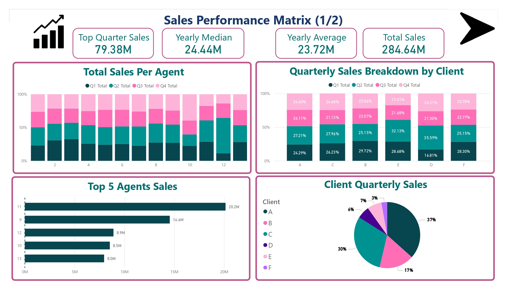

# 📊 Sales Performance Analysis — Power BI Dashboard

## 📖 Project Overview
This project delivers an **end-to-end sales performance analysis** using **Power BI**.  
The goal is to enable stakeholders to quickly answer questions like:
- Who are the **top-performing sales agents**?  
- Which **clients generate the most revenue**?  
- How does performance **change over months and quarters**?  
- What **patterns, anomalies, or trends** exist in the data?  

The dashboard transforms raw sales data into **clear, actionable insights** for **business managers and decision-makers**.

---

## 🚀 Live Interactive Dashboard
👉 [**Click here to explore the dashboard**](https://app.powerbi.com/groups/me/reports/923519fc-bf5c-4319-a62d-66d730732ce3?pbi_source=desktop)

### Previews  
*(Click any image below to view the live dashboard)*  
  
  
[.jpg)](https://app.powerbi.com/groups/me/reports/923519fc-bf5c-4319-a62d-66d730732ce3?pbi_source=desktop)  

---

## 🛠️ Tools & Skills Demonstrated
- **Power BI Desktop** → Data modeling, DAX measures, interactive dashboards  
- **SQL** → Data extraction and transformation (UC Davis SQL for Data Science)  
- **Data Analysis** → Exploratory analysis, KPIs, performance metrics  
- **Data Visualization** → Designing clear and actionable visuals  
- **Storytelling with Data** → Turning raw numbers into business insights  

---

## 📈 Key Insights from the Dashboard
- 🏆 **Top 5 Agents** contribute disproportionately to revenue.  
- 📊 **Quarterly Trends** highlight seasonal performance variations.  
- 👥 **Client An**
